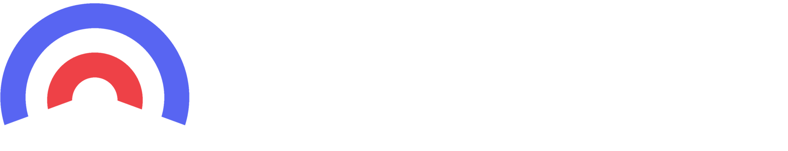

Discord Bot interacting with the French National Assembly and Senate, allowing broadcasting sessions, getting information and more.

## License and copyright

LegiBot is free software: you can redistribute it and/or modify it under the terms of the [GNU General Public License](LICENSE.md) as published by the Free Software Foundation, either version 3 of the License, or (at your option) any later version.

LegiBot is distributed in the hope that it will be useful, but WITHOUT ANY WARRANTY; without even the implied warranty of MERCHANTABILITY or FITNESS FOR A PARTICULAR PURPOSE.  See the GNU General Public License for more details.

You should have received a copy of the GNU General Public License along with LegiBot. If not, see <https://www.gnu.org/licenses/>.

